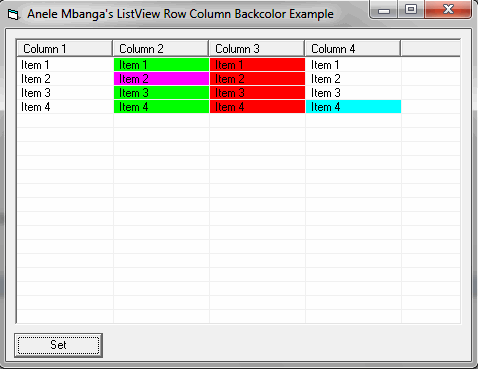



## Kimmo's ListView Subitem Backcolor

### Description

I am currently working on a gantt chart activex and have been searching the internet for code to update the backcolor of listview subitem. I finally figured it out last night after much research. This code enables one to change the listview subitem backcolor to any color that you want. I have off course ported this over an activex for my Gantt chart. You can see the post named Gantt Chart Platform here in psc. Enjoy.
 
### More Info
 

             |
---                |---
**Submitted On**   |2009-12-02 01:11:54
**By**             |[Anele Mbanga](https://github.com/Planet-Source-Code/PSCIndex/blob/master/ByAuthor/anele-mbanga.md)
**Level**          |Advanced
**User Rating**    |4.0 (16 globes from 4 users)
**Compatibility**  |VB 6\.0
**Category**       |[Custom Controls/ Forms/  Menus](https://github.com/Planet-Source-Code/PSCIndex/blob/master/ByCategory/custom-controls-forms-menus__1-4.md)
**World**          |[Visual Basic](https://github.com/Planet-Source-Code/PSCIndex/blob/master/ByWorld/visual-basic.md)
**Archive File**   |[Kimmo's\_Li2169161222009\.zip](https://github.com/Planet-Source-Code/anele-mbanga-kimmo-s-listview-subitem-backcolor__1-72693/archive/master.zip)

